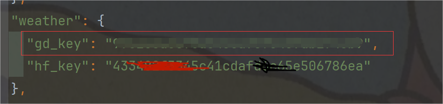

## wecat公众号推送模板

​			最近抖音的情侣推送天气有点火，顺手用python写了一个模板的发送；不只是普通模板和天气，咱们可以在网上找api修改模板的内容，自定义比如每日星座运势、搞笑段子等。
api尽量在网上找到免费、免验证的。

## 主要功能

- **天气信息推送：** 通过调用天气 API 获取实时的天气情况，并以模板消息的形式发送给用户。
- **自定义内容：** 利用免费的 API 获取各种有趣的内容，例如每日星座运势、搞笑段子等，并与天气信息一起发送给用户。
- **灵活配置：** 用户可以根据自己的需求灵活配置模板消息的内容，包括天气、星座运势、段子等。

## 如何使用

1. **克隆仓库：** `git clone https://github.com/yourusername/douyin-couple-weather.git`
2. **安装依赖：** 使用 `pip install -r requirements.txt` 安装所需的 Python 包。
3. **配置参数：** 在 `config.json` 文件中填写相关信息，如微信公众号的 AppID、AppSecret、模板ID 等。
4. **运行程序：** 执行 `python tianqi.py` 开始发送模板消息给用户。


## 贡献者

- [Amengclass (剑姬同学)](https://github.com/Amengclass)
- [其他贡献者](https://github.com/yourusername/douyin-couple-weather/contributors)

## 反馈与建议

如果您有任何问题、建议或者发现了 bug，请随时提出 [Issues](https://github.com/Amengclass/wechat-office/issues)，我们会尽快处理。感谢您的贡献！


## 使用详细教程

#### 首先访问 https://mp.weixin.qq.com/debug/cgi-bin/sandbox?t=sandbox/login

登录后台得到appID 和 appsecret  分别填入`config.json文件`中


修改到这个部分


### test.py 测试用的

可以收到通知，自定义内容


#### 1、新建的模板 (用于test.py)

```
测试1：{{date.DATA}}
测试2：{{city.DATA}} 
测试3：{{weather_now.DATA}} 
测试4：{{temprature_now.DATA}}
测试5：{{temprature_today.DATA}}
测试6：{{win.DATA}}
测试7：{{rainbow.DATA}}
```


添加成功后如图：将模版ID复制下来


然后修改进到`config.json`里


写到这；扫二维码关注后可以看见多了用户的微信号信息，放到上边的`touser`里就好。


#### 2、运行

请确认`config.json`的以下部分被填写了

```json
 #这是微信注册号
  "wechat": { 
    "AppID": "",   #这里填微信测试号的appId
    "AppSecret": "" #这里填微信测试号的appsecret
  },
#这里是配置的模版部分
  "template": {
    "touser": "",   #这里填推送用户id
    "template_id": "", #这里填模板id
    "url": "" #这里填点击模板想要跳转到界面，例如www.baidu.com
  }
```


#### 3、效果


### tianqi.py  天气推送

效果图


别的功能大家酌情增加吧

同上，新建模板然后替换模板id   ʕ•ᴥ•ʔ

```python
🗓️今天是{{date.DATA}} o(〃'▽'〃)o
🏙️城市：{{city.DATA}} ヾ(≧▽≦*)o
⛅️今日天气(❁´◡`❁)
     当前：{{weather_now.DATA}} 
     白天：{{weather_day.DATA}} 
     夜晚：{{weather_night.DATA}} 
🌡️温度：{{temprature_now.DATA}}
   范围：{{temprature_today.DATA}}
🎈凤向：{{win.DATA}}╰(*°▽°*)╯
每日一言：🌈{{rainbow.DATA}}🌈
```


这里用到天气的api，所以需要申请相关的key配置一下

##### [高德天气(点击跳转)](https://console.amap.com/dev/index)

###### 注册登录


###### 然后创建key即可


把这个key复制下来，修改进`config.json`文件里




##### [和风天气(点击跳转)](https://id.qweather.com/#/login?redirect=https%3A%2F%2Fconsole.qweather.com)

###### 注册登录


###### 然后添加key


同样的把这个key复制下来替换进`config.json`中


也就是`添加了两个key`

运行 tianqi.py 即可

```
python tianqi.py
```

### config.json修改说明

```json
{
   #这是微信注册号
  "wechat": { 
    "AppID": "",    #这里填微信测试号的appId
    "AppSecret": "" #这里填微信测试号的appsecret
  },
  #这里是天气api的key
  "weather": {
    "gd_key": "",  #这里填高德天气key
    "hf_key": "",  #这里填和风天气key
  },
  #这里是配置的模版部分
  "template": {
    "touser": "",      #这里填推送用户id
    "template_id": "", #这里填模板id
    "url": "" #这里填点击模板想要跳转到界面，例如www.baidu.com
  }
}
```


### 免费服务器托管自动运行：每天自动推送

#### 1、[点击打开pythonanywhere](https://www.pythonanywhere.com/)

#### 2、点击进行注册


#### 3、注册成功后的界面


如果看不懂英文，就将页面转为中文即可

选择右上角的`Files`


#### 4、新建文件夹

​	我这里叫做	`wechat`(随便起什么名字都可以)，然后点击`New directory`


#### 5、点击上传文件

选择`config.json`和`tianqi.py`文件进行上传


#### 6、试运行

​	双击`tianqi.py`文件，试运行，确保配置正确


如果到这里都没有问题，说明配置都已经正确，接下来我们设定定时任务自动运行

返回到主页，选择`Tasks`


#### 7、然后添加一个定时任务

- [ ] 首先时间：

​		与北京时间有8小时时差，自己算即可，如果你是想中午12点推送，那么12-8＝4，所以你就设定4:00 utc即可

- [ ] 其次是Command or path to script(eg./home/yourusername/yourscrip.py）

  ```python
  cd /home/xhf/wechat && python tianqi.py
  ```

其中`/home/xhf/wechat`是我之前上传到的文件夹路径，怎么看呢？

你只需要打开你存储py文件的那个文件夹，然后复制左上角即可，如果你的存储文件夹名称和我一样是`wechat`，那么你只需修改xhf为你的账户名称即可


- [ ] 最后Optional description

 随便填写什么任务描述都可以


如图，就配置好了自动任务，我的在每天的早上7点，就会运行，推送消息了


### 附录

#### test.py代码

```python
# -*- coding: utf-8 -*-
# @Author: xhf
# @Date:   2024.4.1

import requests
import json


# 从config.json中读取配置信息
def read_config():
    """
       读取配置文件并返回配置内容。

       Returns:
           dict: 包含配置信息的字典对象，如果文件不存在或解析失败，则返回空字典。
       """
    with open('config.json', 'r') as file:
        return json.load(file)

config = read_config()

def get_token(AppID, AppSecret):
    """
        获取微信 access_token。

        Args:
            AppID (str): 微信应用的 AppID。
            AppSecret (str): 微信应用的 AppSecret。

        Returns:
            str: 获取到的 access_token。
        """
    url = 'https://api.weixin.qq.com/cgi-bin/token?grant_type=client_credential&appid={0}&secret={1}'.format(AppID,
                                                                                                             AppSecret)

    r = requests.get(url)
    data = json.loads(r.text)
    return data["access_token"]

# 发送消息
def send_message(touser, token, info=None, rainbow_text=None):
    """
        发送消息。
        Args:
            touser (str): 接收消息的用户 openid。
            token (str): 微信 access_token。
            info (dict): 包含天气信息的字典。
            rainbow_text (str): 彩虹屁文本。
    """
    url = 'https://api.weixin.qq.com/cgi-bin/message/template/send?access_token={0}'.format(token)
    data = {
        "touser": touser,
        "template_id": config["template"]["template_id"],
        # "url": info['link'],
        "topcolor": "#FF0000",
        "data": {
            "date": {
                "value": "你好",
                "color": "#000"
            },
            "city": {
                "value": "没问题",
                "color": "#000"
            },
            "weather_now": {
                "value": "我的测试",
                "color": "#000"
            },
            "temprature_now": {
                "value": "太多了吧",
                "color": "#000"
            },
            "temprature_today": {
                "value": "啦啦啦啦",
                "color": "#000"
            },
            "win": {
                "value": "sdfsf",
                "color": "#000"
            },
            "rainbow": {
                "value": "sfsdf",
                "color": "#000"
            }
        }
    }
    response = requests.post(url=url, data=json.dumps(data))
    if response.json()['errmsg'] == 'ok':
        print('\033[91m' + '推送成功' + '\033[0m')  # 输出红色文字
    else:
        print('\033[91m' + '推送失败' + '\033[0m')  # 输出红色文字


if __name__ == '__main__':
    token = get_token(config["wechat"]["AppID"], config["wechat"]["AppSecret"])
    # 要推送的用户
    touser = config["template"]["touser"]
    send_message(touser, token)
```


#### tianqi.py代码

```python
# -*- coding: utf-8 -*-
# @Author: xhf
# @Date:   2024.4.1

import requests
import json


# 从config.json中读取配置信息
def read_config():
    """
       读取配置文件并返回配置内容。

       Returns:
           dict: 包含配置信息的字典对象，如果文件不存在或解析失败，则返回空字典。
       """
    with open('config.json', 'r') as file:
        return json.load(file)


config = read_config()


# 从微信 API 获取访问令牌的函数
def get_token(AppID, AppSecret):
    """
        获取微信 access_token。

        Args:
            AppID (str): 微信应用的 AppID。
            AppSecret (str): 微信应用的 AppSecret。

        Returns:
            str: 获取到的 access_token。
        """
    url = 'https://api.weixin.qq.com/cgi-bin/token?grant_type=client_credential&appid={0}&secret={1}'.format(AppID,
                                                                                                             AppSecret)

    r = requests.get(url)
    data = json.loads(r.text)
    return data["access_token"]


# 获取天气信息
def get_weather(city_id, location):
    """
       获取天气信息。
       Args:
           city_id (str): 城市 ID，用于调用高德天气 API
           location (str): 城市名称，用于调用和风天气 API

       Returns:
           dict: 包含天气信息的字典对象，包括链接、日期、城市、温度、天气状况、风向、日出和日落时间。
       """
    # 高德
    url1 = r'https://restapi.amap.com/v3/weather/weatherInfo?city={0}&key={1}'.format(
        city_id, config['weather']['gd_key'])
    response1 = requests.get(url1)  # 发送请求获取天气信息
    data1 = response1.json()
    print(data1)

    # 获取城市id
    url_id = r'https://geoapi.qweather.com/v2/city/lookup?location={0}&key={1}'.format(
        location, config['weather']['hf_key'])
    response_id = requests.get(url_id)
    data_id = response_id.json()
    hf_cityid = data_id['location'][0]['id']

    url2 = r'https://devapi.qweather.com/v7/weather/3d?location={0}&key={1}'.format(
        hf_cityid, config['weather']['hf_key'])
    response2 = requests.get(url2)
    data2 = response2.json()
    print(data2)

    # 城市
    city = data1['lives'][0]['city']
    #
    # 温度
    temp = {}
    temp['today'] = data2['daily'][0]['tempMin'] + u'°C' + '~' + data2['daily'][0]['tempMax'] + u'°C'
    temp['now'] = data1['lives'][0]['temperature'] + u'°C'
    #
    # 天气状况
    weather = data1['lives'][0]['weather']

    # 风向
    win = data1['lives'][0]['winddirection'] + u'风 ' + data1['lives'][0]['windpower'] + u'级'

    # 日期
    date = data2['daily'][0]['fxDate']

    sum_time = {}
    # 日出和日落时间
    sum_time["sunrise"] = data2['daily'][0]['sunrise']
    sum_time["sunset"] = data2['daily'][0]['sunset']

    return {'link': data2['fxLink'], 'date': date, 'city': city, 'temp': temp, 'wea': weather, 'win': win,
            "sun_time": sum_time}


# 彩虹屁
def get_rainbow():
    """
        获取彩虹屁。
        Returns:
            str: 彩虹屁文本。
    """
    url = 'https://v1.hitokoto.cn/'
    response = requests.get(url)
    data = response.json()
    print(data["hitokoto"])
    return data["hitokoto"]


# 发送消息
def send_message(touser, token, info, rainbow_text):
    """
        发送消息。
        Args:
            touser (str): 接收消息的用户 openid。
            token (str): 微信 access_token。
            info (dict): 包含天气信息的字典。
            rainbow_text (str): 彩虹屁文本。
    """
    url = 'https://api.weixin.qq.com/cgi-bin/message/template/send?access_token={0}'.format(token)
    data = {
        "touser": touser,
        "template_id": config["template"]["template_id"],
        "url": info['link'],
        "topcolor": "#FF0000",
        "data": {
            "date": {
                "value": info['date'],
                "color": "#000"
            },
            "city": {
                "value": info['city'],
                "color": "#000"
            },
            "weather_now": {
                "value": info['wea'],
                "color": "#000"
            },
            "temprature_now": {
                "value": info['temp']['now'],
                "color": "#000"
            },
            "temprature_today": {
                "value": info['temp']['today'],
                "color": "#000"
            },
            "win": {
                "value": info['win'],
                "color": "#000"
            },
            "rainbow": {
                "value": rainbow_text,
                "color": "#000"
            }
        }
    }
    response = requests.post(url=url, data=json.dumps(data))
    if response.json()['errmsg'] == 'ok':
        print('\033[91m' + '推送成功' + '\033[0m')  # 输出红色文字
    else:
        print('\033[91m' + '推送失败' + '\033[0m')  # 输出红色文字


if __name__ == '__main__':
    token = get_token(config["wechat"]["AppID"], config["wechat"]["AppSecret"])
    info = get_weather(city_id="450323",location="灵川") # 把这里的city_id改为自己城市id，location改为自己城市名字
    rainbow_text = get_rainbow()

    # 要推送的用户
    touser = config["template"]["touser"]
    send_message(touser, token, info, rainbow_text)
```


